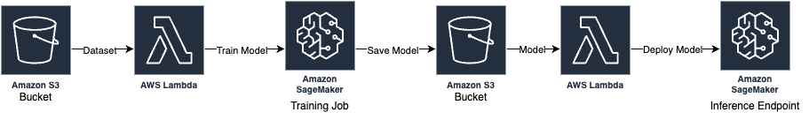

# MLOps Pipeline with AWS CDK

This project demonstrates an MLOps pipeline constructed using the [AWS Cloud Development Kit (AWS CDK)](https://docs.aws.amazon.com/cdk/v2/guide/home.html). The pipeline automates the training and deployment of machine learning models using AWS Lambda, Amazon S3, and Amazon SageMaker, triggered by data uploads to an S3 bucket.

## Project Structure

- `lambda_code/`: Directory containing the code for AWS Lambda functions that trigger model training and deployment.
- `mlops_project/`: Directory containing the AWS CDK stack definition.
  - `__init__.py`: Initialization file for the `mlops_project` module.
  - `mlops_project_stack.py`: The AWS CDK stack definition file.
- `training_code/`: Directory containing the code and Jupyter Notebook for preprocessing and training the model using Hugging Face on Amazon SageMaker Studio.
- `README_CDK.md`: Default README file generated by AWS CDK.
- `app.py`: The main file for the AWS CDK app.
- `cdk.json`: Configuration file for the AWS CDK app.
- `requirements-dev.txt`: Python dependencies required for development.
- `requirements.txt`: Python dependencies required for the project.
- `source.bat`: Script file for setting up the environment.

## AWS CDK (Cloud Development Kit)

AWS CDK is an open-source software development framework to define cloud infrastructure as code (IAC) and provision it through AWS CloudFormation. It allows developers to define cloud infrastructure in code and provision it through AWS CloudFormation. The CDK integrates fully with AWS services and offers a high-level object-oriented abstraction to define AWS resources imperatively.

## Setup

1. **AWS CLI and Credentials**:
   - Install [AWS CLI](https://aws.amazon.com/cli/).
   - Configure AWS CLI with the credentials using `aws configure`.

2. **AWS CDK CLI**:
   - Install AWS CDK CLI: `npm install -g aws-cdk`.

3. **Python Dependencies**:
   - Install Python dependencies: `pip install -r requirements.txt`.

4. **Bootstrap AWS CDK App**:
   - Bootstrap the AWS CDK app: `cdk bootstrap`.

## Deployment

1. **Synthesize AWS CDK App**:
   - Synthesize the AWS CDK app: `cdk synth`. This command will generate an AWS CloudFormation template for the app.

2. **Deploy AWS CDK App**:
   - Deploy the AWS CDK app: `cdk deploy`. This command will create and update the necessary AWS resources defined in the app.

## Usage

1. **Upload Training Data**:
   - Upload the training data to the S3 bucket at `s3://<bucket-name>/MLOps-Project/Input/Dataset/train/`.

2. **Automatic Model Training**:
   - The training Lambda function will automatically trigger a SageMaker training job upon data upload. The training image and datasets used to train the model are created from `training_code/sagemaker_huggingface_code.ipynb`.

3. **Model Deployment**:
   - Once the training job is complete, the trained model will be saved to `s3://<bucket-name>/MLOps-Project/Models/`.
   - The deployment Lambda function will automatically deploy the trained model to a SageMaker endpoint.

## Cleanup

1. **Delete SageMaker Endpoint**

2. **Delete S3 Bucket**

3. **Delete AWS CDK Stack**:
   - Delete the AWS CDK stack: `cdk destroy`.

## IAM Roles and Policies

This project uses existing IAM roles and policies for permissions. Ensure that the roles and policies used have the necessary permissions for AWS Lambda, Amazon S3, and Amazon SageMaker.
